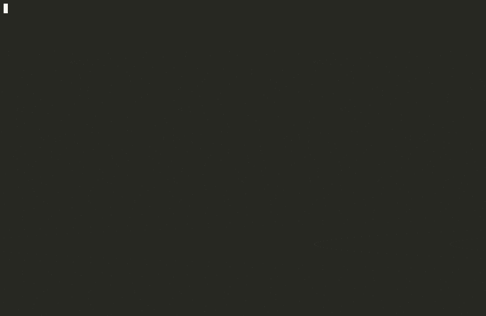

# effect-v4-audit

Deterministic CLI audit for v3-era Effect APIs in Effect v4 migrations.
Built on Effect v4 beta CLI APIs (`effect/unstable/cli`).

## Demo



## Install

```bash
bunx effect-v4-audit --help
```

## Local Development

```bash
git clone https://github.com/agustif/effect-v4-audit.git
cd effect-v4-audit
bun install
```

Then run:

```bash
bun run ./src/bin.ts --help
```

## Usage

```bash
effect-v4-audit \
  --cwd . \
  --pattern "**/*.{ts,tsx,mts,cts}" \
  --ignore "**/*.gen.ts" \
  --color auto \
  --format diagnostic \
  --fail-on-findings
```

## Output

- `diagnostic`: rust-style diagnostics with source snippet and `help` hint.
- `table`: compact findings with path, line/column, and migration suggestion.
- `json`: stable machine-readable report for CI.

## Guarantees

- deterministic file ordering and finding ordering
- deterministic summary counters and per-rule map ordering
- exits with code `1` only when `--fail-on-findings` is passed and findings exist

## Limitations

- rule-based text scan; does not parse full TypeScript AST
- may flag strings/comments containing legacy API text
- rules are intentionally conservative and not a full migration codemod
